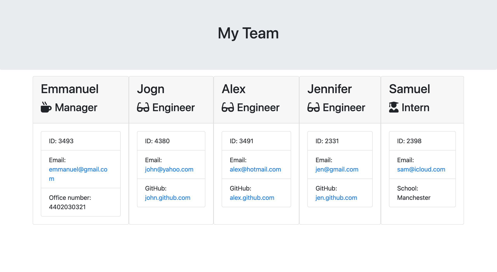

# Team Profile Generator

## Description
This project allows users to generate a webpage that displays my team's basic info. This application will take in information about employees on a team, then generates an HTML webpage that displays summaries for each person.

## Table of Contents
- Installation
- Usage
- Test
- License

## Installation
After cloning the repository users can run npm init to initialise node and run npm install inquirer@^8.0.0 to install inquirer.

## Usage
Run node index.js and answer the prompt questions.

## Test
Run npm test to run Jest for tests on constructors.

## License
MIT License